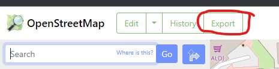
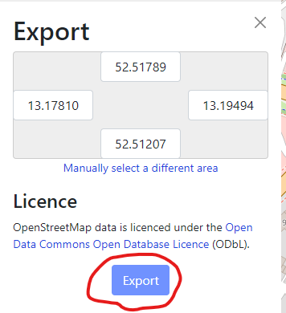
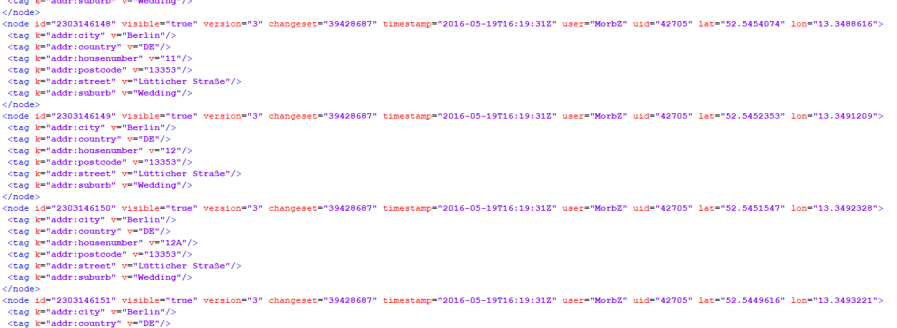
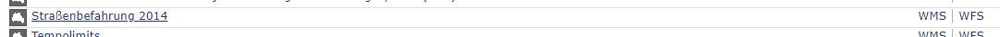
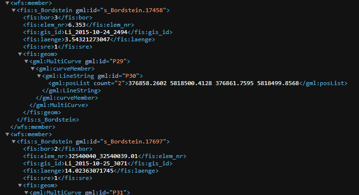
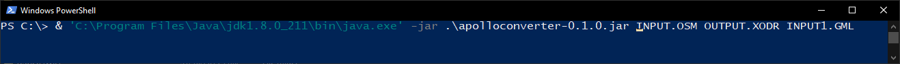

# Apollo OpenDRIVE Converter
This is a conversion tool written in Java for converting OSM and Berlin Road Inspection GML data into the Apollo OpenDRIVE format.  
Compiled binaries can be found in the release section on the right.
## Compiling the source code
If you are using one of compiled release binaries you can skip this section and continue with getting the data for the conversion.  
The source code can either be loaded into an IDE or be compiled via command line. The project has the following dependencies:
- cts-1.5.2
- google-collections-1.0-rc2
- jaxb-core-2.3.0
- jaxb-impl-2.3.0
- jaxb-xjc-2.3.0
- jts-core-1.17.1
- lucene-core-8.7.0
- lucene-spatial-8.4.1
- slf4j-api-1.7.36
- stax-utils-20070216
  
## Getting the data for the conversion process
The conversion process requires at least an OSM file to create a basic road network. Additionally one or more Berlin Road Inspection GML files can be provided to enhance the quality of the resulting Apollo OpenDRIVE HD map. This section gives a quick overview on how to obtain the necessary data from the two data sources.
### OSM Data
For OSM data, various sources, either official or through third-party services, exist, to download map data in different file formats. The conversion tool currently only supports the .osm file format, which is the most commonly used file format when dealing with OSM data. Depending on the scale of the desired area, different services exist to provide this file format.  
To get OSM data of a geographically limited area the export function of the OSM website can be used. This function can be found in the menu located in the upper left corner of the [OpenStreetMap](openstreetmap.org) website.  
  

Here an area can be selected with the coordinates of the current view being the default value. The export can then be started via the "Export" button and the resulting file will start downloading after a short while. This method will only allow export into the .osm format.  
  

The OSM format is derived by the XML standard. Here is an example of an OSM file downloaded from the official OSM website:

### Berlin Road Inspection Data
Data for the Berlin Road Inspection is publicly available on the official [FIS-Broker](https://fbinter.stadt-berlin.de/fb/index.jsp) of the government of Berlin. It is found under the category "Verkehr" and the application "Straßenbefahrung 2014".  
  

From there, various services providing data on the different feature layers can be accessed. This includes a WMS for image data and WFS services for each feature of the data set. Currently, only road markings ("Fahrbahnmarkierung Linie") and curbstone ("Bordstein") features are supported by the conversion tool.  
To download the respective feature in a given area, it has to be directly requested from the API via an HTTP request. This can be done directly in the browser.  
This is an example of a request for the "Bordstein" feature in a bounding box with the corners at the coordinates 375183.00,5820910.04 and 377867.68,5818479.47:  
  
`https://fbinter.stadt-berlin.de/fb/wfs/data/senstadt/s_Bordstein?&VERSION=2.0.0&SERVICE=WFS&REQUEST=GetFeature&BBox=375183.00,5820910.04,377867.68,5818479.47&TYPENAMEs=s_Bordstein`
  
The resulting file can the be saved via the browser. Below is a snippet of the response to the request above:
  

## Starting the conversion process
The conversion tool can be started via a command line. It takes the following parameters:
- File path to the .osm file
- File path to the output file
- (optional) File paths to the .gml files

The tool needs to be run with Java version 8. This is an example of a command to convert one OSM and one GML file with the Java executable manually selected:  
  
`'C:\Program Files\Java\jdk1.8.0_211\bin\java.exe' -jar .\apolloconverter-0.1.0.jar INPUT.OSM OUTPUT.XODR INPUT1.GML`
  

A set of demo files, containing one OSM file and two GML files are provided with the source code in the "demo" folder.  
All three files contain data of the same area in Berlin.
- [OSM file](demo/osmfile.osm)
- [GML road boundaries file](demo/bordsteine.xml)
- [GML road markings file](demo/fahrbahnmarkierungen.xml)